# Sarcasm-detection
Sarcasm detection from news headlines with CNN-SVM, CNN-LSTM-SVM and BERT based models
 
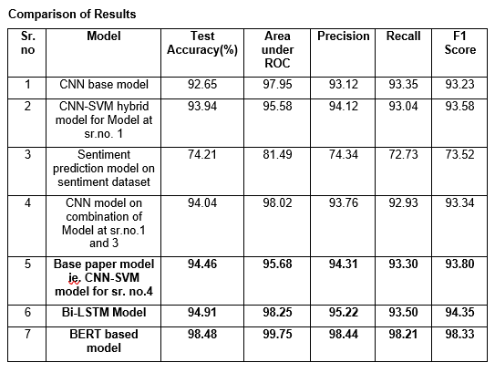

Sarcasm is the use of language that normally signifies the opposite in order to mock or convey contempt. 
Sarcasm can be considered as expressing a bitter gibe or taunt. Sarcasm Detection task is an important task for many natural language processing tasks.
We address a key NLP problem known as sarcasm detection using a combination of models based on convolutional neural networks (CNNs). 
Detection of sarcasm is important in other areas such as affective computing and sentiment analysis because such expressions can flip the polarity of a sentence.
Till now most research approaches to sarcasm detection have treated the task mainly as a text categorization problem. Sarcasm, however, can be expressed in very subtle ways.
It requires a deeper understanding of natural language. Standard text categorization techniques cannot be used in this task effectively. \
Based on a pre-trained convolutional neural network for extracting sentiment, emotion and personality features for sarcasm detection, we develop models for this task.
These types of features, along with the network’s baseline features, allow the proposed models to outperform the state of the art on benchmark datasets. 
Along with this, we are considering generalizability issue of classifying data that have not been seen by the models at learning phase. 
Other than this approach there are two other improvements approach using which we can solve this problem efficiently. 
These two other approaches are : 1) Using RNN architectures, 2) BERT pre-trained model.
 

# In summary, the main contributions of this model are the following: 
+	Apply deep learning to sarcasm detection
+	Leverage sentiment features for sarcasm detection
+	Apply pre-trained models for automatic feature extraction
The two improvement architectures proposed are: 
+	Applying LSTM sequence models for sarcasm detection
+	Making use of BERT pre trained model layer.

# Datasets 
Two datasets are used for this project namely, sarcastic headlines dataset (Kaggle rmisra/news-headlines-dataset-for-sarcasm-detection) and sentiment analysis dataset. ( Kaggle kazanova/sentiment140) 
The Sarcasm dataset consists of 54.2% sarcastic samples.
Word Embeddings: word2vec vectors are employed as input. The vectors are of dimensionality 300, trained using the continuous bag-of-words architecture. Words not present in the set of pre-trained words are initialized randomly. 
Pretrained embeddings are taken from https://www.kaggle.com/yekenot/fasttext-crawl-300d-2m

# CNN-SVM Hybrid models (Sentiment-Sarcasm combination model also) 
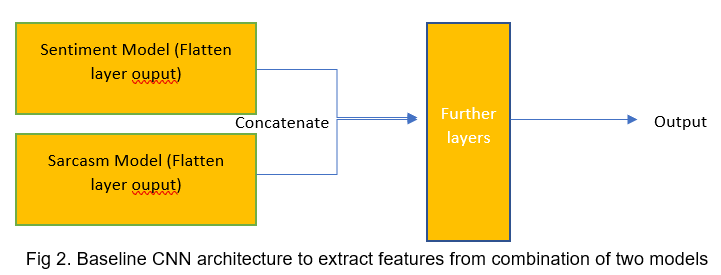
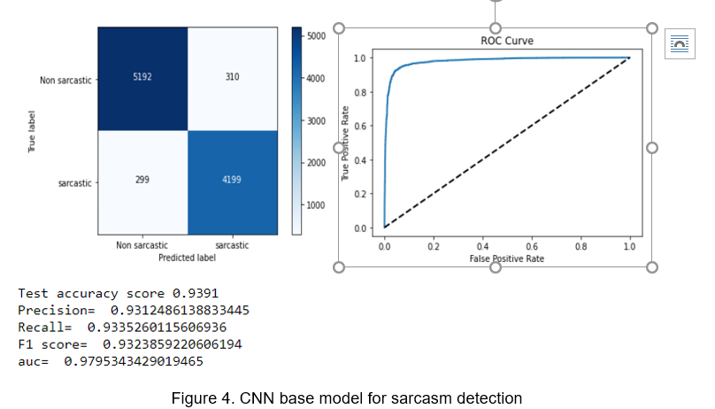
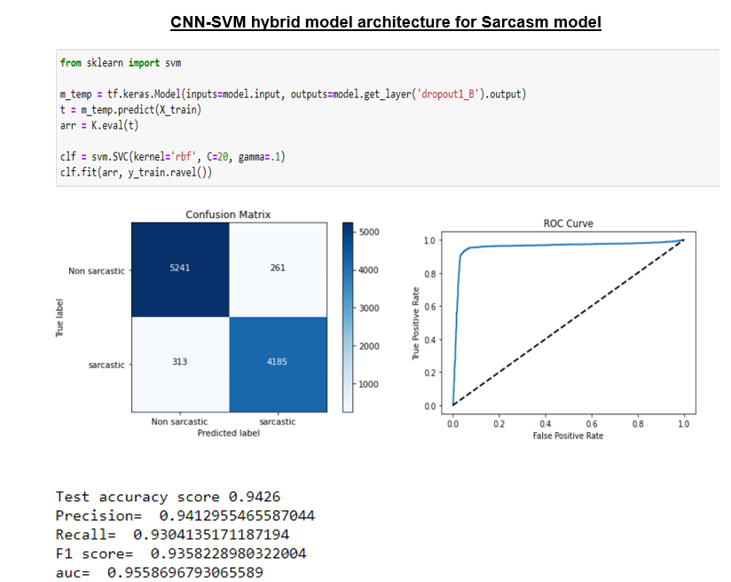
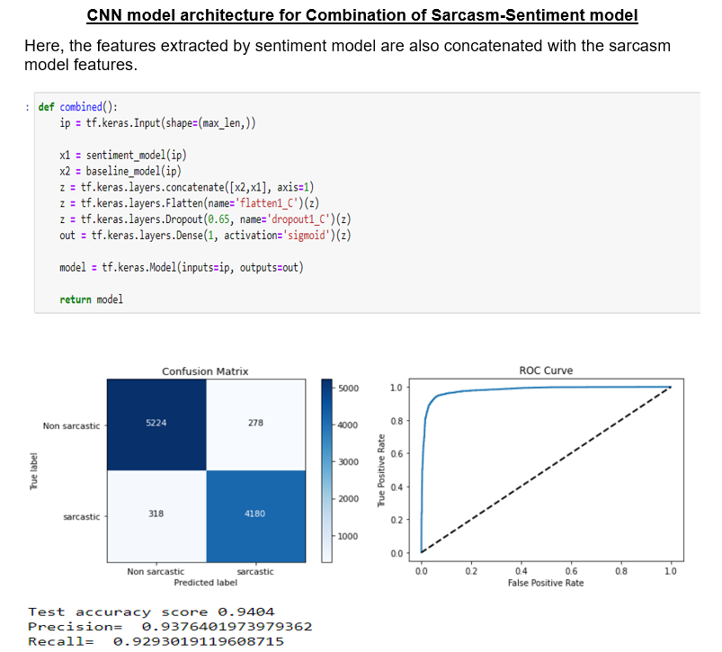
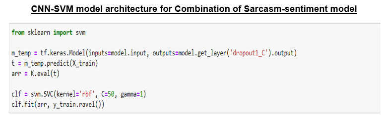
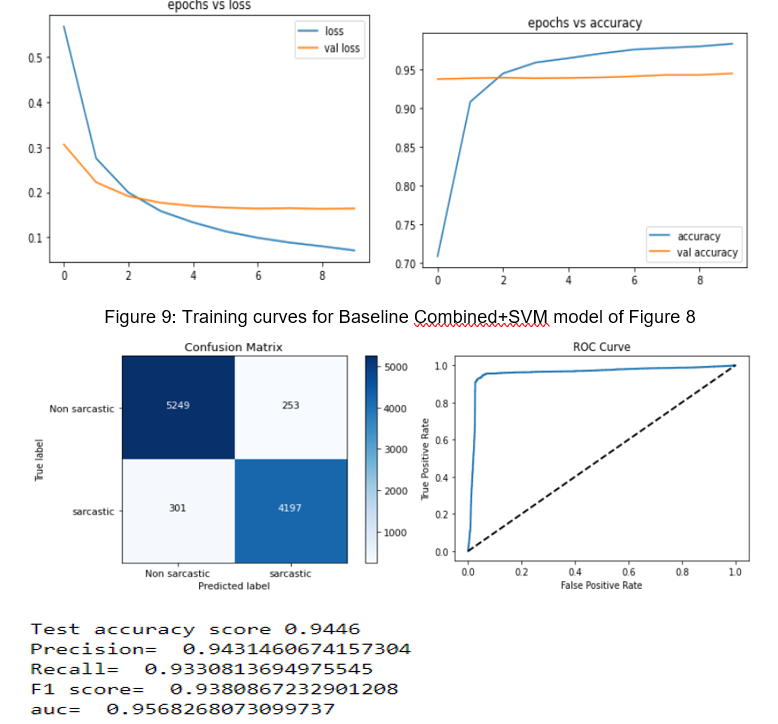

# 	Bi-Long short-term memory (LSTM)
LSTM is an artificial recurrent neural network (RNN) architecture used in the field of deep learning. Unlike standard feedforward neural networks, 
LSTM has feedback connections. It can not only process single data points (such as images), but also entire sequences of data (such as speech or video).
For example, LSTM is applicable to tasks such as unsegmented, connected handwriting recognition, speech recognition and anomaly detection in network 
traffic or IDS's (intrusion detection systems). A common LSTM unit is composed of a cell, an input gate, an output gate and a forget gate. The cell remembers 
values over arbitrary time intervals and the three gates regulate the flow of information into and out of the cell. LSTM networks are well-suited to classifying,
processing and making predictions based on time series data, since there can be lags of unknown duration between important events in a time series. LSTMs were developed
to deal with the vanishing gradient problem that can be encountered when training traditional RNNs.
Relative insensitivity to gap length is an advantage of LSTM over RNNs, hidden Markov models and other sequence learning methodsin numerous applications.\

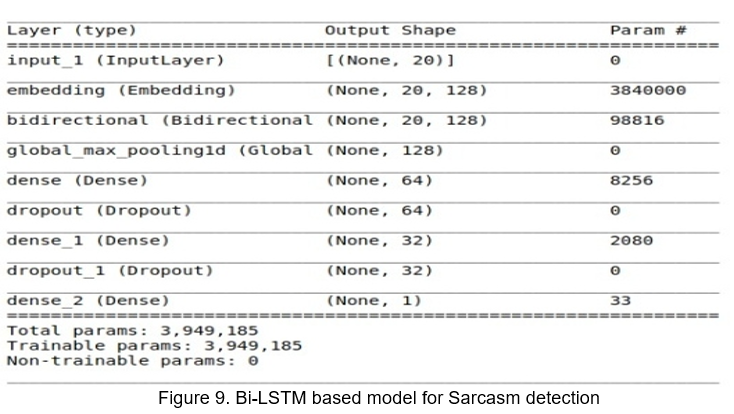
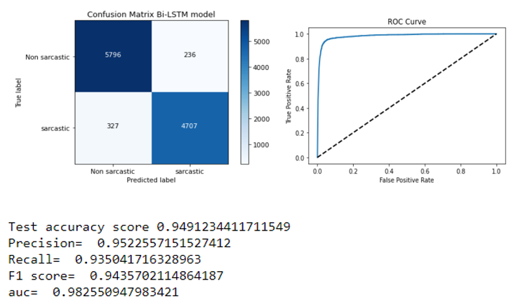
# BERT MODEL
BERT is designed to pre-train deep bidirectional representations from unlabelled text by jointly conditioning on both left and right context in all layers. As a result, the pre-trained BERT model can be fine-tuned with just one additional output layer to create state-of-the-art models for a wide range of tasks, such as question answering and language inference, without substantial task-specific architecture modifications.
BERT is conceptually simple and empirically powerful. It obtains new state-of-the-art results on eleven natural language processing tasks, including pushing the GLUE score to 80.5% (7.7% point absolute improvement), MultiNLI accuracy to 86.7% (4.6% absolute improvement), SQuAD v1.1 question answering Test F1 to 93.2 (1.5 point absolute improvement) and SQuAD v2.0 Test F1 to 83.1 (5.1 point absolute improvement).

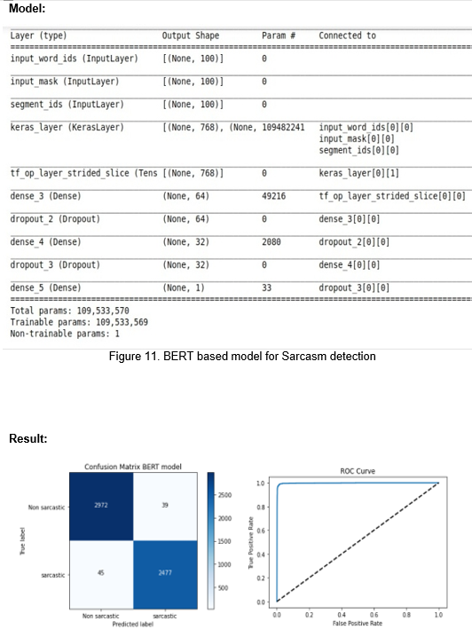
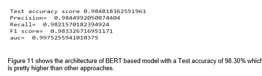

# Conclusion
LSTM are more effective in this sarcasm detection because LSTM being sequence model, the cell state is moved forward and backward while in case of CNN each word is localised and  independent of each other ie. Sequence of words converted into sequence of vectors which are then fed into CNN like an image by reshaping the Input vector, which doesn’t preserve the actual semantics. The weights of this embedding layer get trained after the training process. It uses Bidirectional LSTM because the later words might also affect meaning of previous words in sarcastic sentences, so Bidirectional LSTM ensures that cell information flows in both directions.
BERT represents input as subwords and learns embeddings for subwords. So it has a vocabulary that is about 30,000 for a model trained a corpus with a large number of unique words (~ millions) - which is much smaller in contrast to a Glove, Word2vec, or ELMo model trained on the same corpus. Representing input as subwords as opposed to words has become the latest trend because it strikes a balance between character based and word-based representations - the most important benefit being avoidance of OOV (out of vocabulary) cases which the other two models (Glove, Word2vec ) mentioned suffer from. There has been recent work that character-based language models do not perform as well as word-based models for large corpus, which is perhaps an advantage subword based models have over character-based input models like Elmo. Having a fixed size vocabulary like BERT has a practical advantage of being able to load the vectors in a GPU regardless of corpus size ( a problem that prevented earlier models like context2vec from being used at scale on a large corpus).
